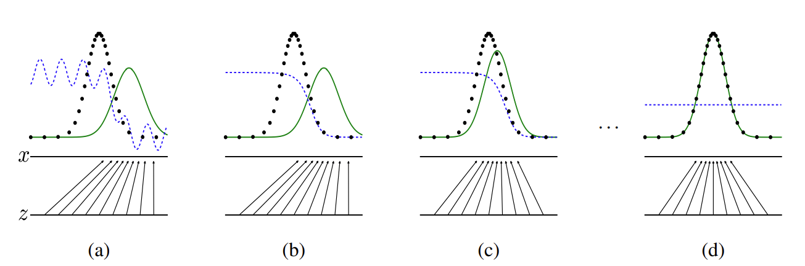

# Generative Adversarial Nets Notes

## Abstract Notes

- Estimate generative models using 2 neural network models
- Train models simultaneously, a generative model G and a discriminative model D
- Role of G is to maximise the probability of D making a mistake
- Role of D is to estimate if the sample came from the training data set or G
- Purpose is to allow for new similar data to be created from G

## Introduction

- Deep learning is used to represent the probability distribution for different kinds of data
- Deep learning has had success through backpropogation and dropout algorithms
- Use linear units which have gradients
- Traditional machine learning methods have not been as effecitvie with generative models

- In GANs the generative model is put against another model called a discriminator
- Generative model can be visualised as a team of countefeiters trying to produce fake currency and use it without detection
- The Discriminator model can be visualised as the police who are trying to detect the counterfeit currency
- The competition between the two mdoels improves each modelm until the counterfeits are indistiguishable from the real data
- When the generator model and the discriminative both use multilayer perceptron this is called adversarial nets
- In this case we can use backpropagrion and dropout algorithms
- The sample from the Generative model with only use forward propagation

## Related Work

- Boltzmann machines and deep Boltzmann machines
- gradient can sometimes be hard to change
- Dont want the model to be relient on Markov Chain Monte Carlo (MCMC) methods
- Some models can be trained by back propagationss
- The GSN framework uses this
- Adversial nets framework do no require a Markov chain for sampling

## Adversial nets

- easy to apply when the models are both multilayer perecptrons
- Discriminator has a single output variable to decide the probability if it came from the generator or the real data
- Train D to maximise the probability of assigning the correct label
- Train G to minimise the log(1-D(G(z)))
- G and D play a game of min max
- 
$min
G
max
D
V (D, G) = Ex∼pdata(x)
[log D(x)] + Ez∼pz(z)
[log(1 − D(G(z)))].$
- To stop overfitting of one model, we alternate the training between k steps of optimising the D model and one step of optimising the G model
- This causes D the be maintained near its optimal solution, as long as G changes slowly
- However this can cuase G to not leran very well as the gradients are not high enough to cause effecient learning in the early stages
- To fix this we can change the aim of G to not minimise the effectiveness of D but do maximise the errors of D
- 

### Figure 1

- In figure 1 the dashed blue line is the Discriminator
- This is done between samples from the real data (black line) and the Generator (green solid line)
- a: At the start the Discriminator is random in its prediction as seen by the wavy blue ine.
- b: After the first training of D, it can now classify between real and fake data well
- c: After G is now trained, it shifts across to go to regions that are more likely to be classed as real data by the D
- d: After several training loops the models will reach a point where they can't improve. G is now very similar to the real data and D cannot differentiate between the real and generated data
- This can be seen as D(x) = 1/2 as it is guessing 50/50

## Theoretical Results

- 